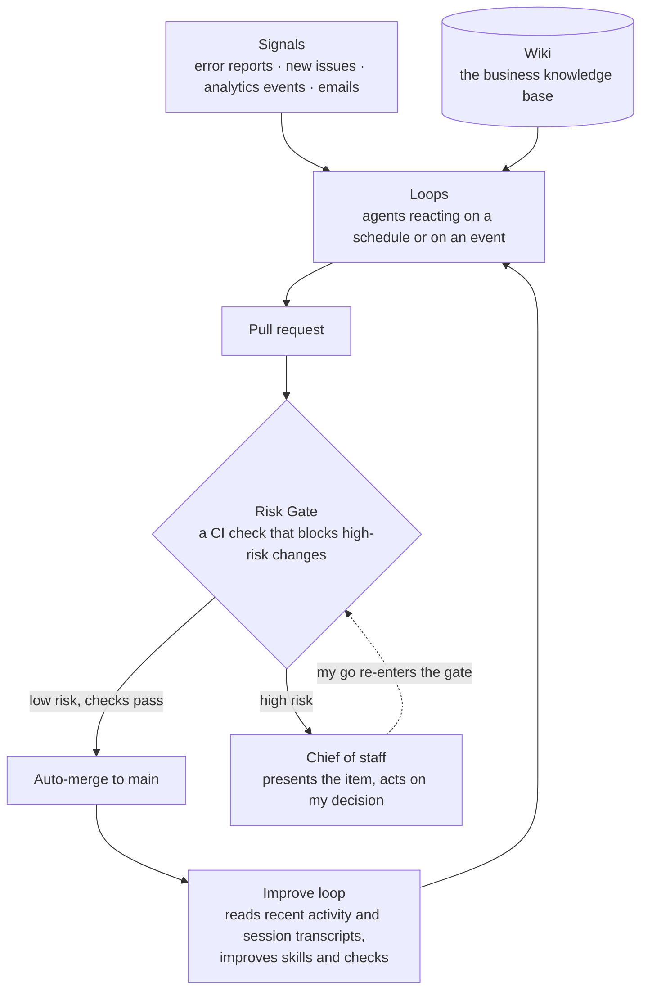

# The self-building factory

Building a business that builds itself without reading a single line of code. That's the goal I set for myself.  
  
As a Software Engineer with a master's degree in Computer Science and 3+ years of experience building apps with 20,000+ monthly active users, I believe in my ability to review generated code and make suggestions to improve it.  
  
I have worked with large language models (LLMs) for coding and later on agents on a daily basis over the past 2 years, so I know that they sometimes write code in ways that make it harder to test, scale or maintain. Especially when they lack context on language specifics, style guidelines or APIs.

As a result it was much harder for me to consciously *not* read any code, knowing that some implementation choices might be less than optimal, and instead design systems on a higher level that lead to a healthy, self-building business.  
  
This artifact contains some of the errors I made in the past few months in my attempt at building such an AI-first business and how I'm changing what I do as a result.

## The shape of the thing

On a high level we have the following components:  
- **Signals** - Information flowing into the system that might require taking an action like fixing a bug or building a new feature  
- **Loops** - Agents that act on signals on a schedule or are triggered from an event like an issue alert  
- **Risk Gate** - Classifier that decides if a change can be auto-merged or needs human review  
- **Chief of staff** - An agent that goes through each change that needs human review and acts on my decisions  
- **Wiki** - Knowledge base to structure research about the market, competitors, tools and more  
- **Improve loop** - An agent that proposes improvements to the system based on recent activity  

Everything is defined and stored in a git repository so agents always have access to all necessary context about the business.
  
### Signals
Anything that goes into the system can be a signal. Error reports, new issues created by another agent or human, analytics events, or emails.  

Traditionally, a human reacted to these signals by triaging them, deciding if and how to act and then acting on them.  

In the AI-first business, agents react to these signals.

### Loops
There are two types of loops.  
- **Event-based** - A signal entering the system immediately triggers an agent to react to it  
- **Scheduled** - A schedule prompts an agent session to react to one or multiple signals

#### What it does
Depending on the specifics of the loop, an agent might triage and create an issue, make changes to code, notify a human, or drop a non-actionable signal.

#### When to use
- **Event-based loops** - Use for signals that require a quick reaction like issue alerts.  
- **Scheduled loops** - Use on signals that can be processed in batch, or are fine to process at a delay.

#### Examples
- **Error fixer** - Event-based. Analyzes a given error report and creates a pull request with a fix
- **Reply triage** - Scheduled. Reads email inbox and drafts responses
- **Accessibility hardening** - Scheduled. Finds accessibility issues and creates a pull request with fixes
- **CI-failure fixer** - Event-based. Fixes the given, failing CI/CD workflow on main

### Risk Gate
Pull requests are auto-merged once all continuous integration checks pass. The Risk Gate is a check that fails for high-risk changes and blocks them from auto-merging. High-risk pull requests require human approval – usually done via the chief of staff.

### Chief of staff
An agent that presents issues and pull requests requiring human review.  
  
It follows this process:
1. Present the first item, describing it on a high level in a non-technical way
2. Wait for the user's decision on that item
3. Repeat from step 1 until all items have a decision
4. Act on the decisions

### Wiki
Based on Andrej Karpathy's [llm-wiki.md](https://gist.github.com/karpathy/442a6bf555914893e9891c11519de94f).  
  
The knowledge base of the business. Research results and artifacts containing relevant information are stored in a structured format.  
  
New information is dumped into an input directory. An agent reads the information, structures and integrates it into the wiki, creating references to existing knowledge.  
  
### Improve loop
Reads recent activity in the repository and agent session transcripts and makes improvements to the system. Improvements can be changes to agent skills, hardening pull request checks and more.

The skills themselves stay small and single-purpose – [here's one](../skills/red-team/SKILL.md) that runs an adversarial review with two subagents.

## What happened
When designing the system, I was very excited about the autonomy I expected it to have.  

But the initial build of the system burned through my weekly AI usage limits. As a result, the system was disabled for the first few days and didn't add any value. It even prevented the outreach agents from sending out emails and making progress on getting our first customer.  

Once the usage reset, I enabled the loops again and they started working on existing issues, improving accessibility and implementing new features. But pull requests started piling up – blocked – instead of being merged.  
  
Turns out 90% of the changes the agents made were classified as risky and blocked by the Risk Gate.  
  
At that point I had zero customers and a system that barely moved, while eating hundreds of euros per month in tokens and tool costs.  
  
I realized that I'd been putting all of my focus on building an autonomous software factory, when I neither had a single customer, nor product-market fit.  
  
So I adjusted the Risk Gate to be more permissive and kept only outreach and a couple of maintenance loops running.  
  
Doing that change also revealed a pattern of me over-engineering the system. We had 61 pull request checks, 50% of which were testing the machinery itself.  
  
The system as it was not only burned through tokens quickly. It was also slow and using lots of runner minutes on all those checks.  

## What I'm taking away
When building a business, focus on the constraint of the business. Creating a complex software factory without customers and product-market fit is a distraction, even if it feels productive. Manually managing multiple agent sessions does the job well until patterns emerge that are worth automating.  

Focusing on the bottleneck will naturally lead you to the next action.
- Updating the AGENTS.md, because agents keep misspelling the company name.
- Creating an agent skill, because you just did a workflow for the 5th time in the past few days.
- Building a loop, because the agent skill works reliably and you need your attention for the new constraint.
- Assembling a software factory, because your loops run reliably, you have product-market fit and want to spend more time with your family.

The experiment of "not reading a single line of code" showed that not reading *any* agent output still leads to over-engineering, tons of tiny bugs in code and a business that burns money faster than it generates. Even when carefully brainstorming specifications on a high level.  

Going forward I'll be engineering the context for the business – AGENTS.md, skills, documentation, available tools – myself and let agents continue to generate infrastructure, configuration and code.
